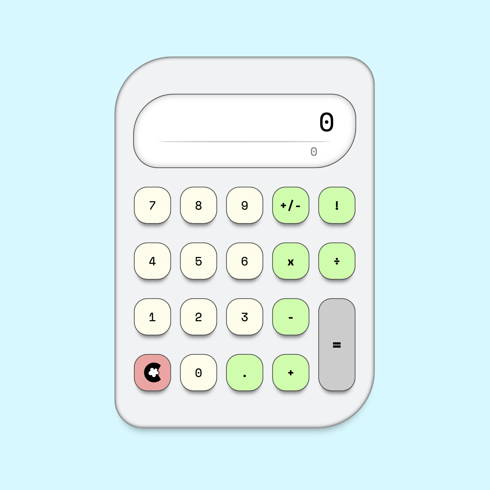
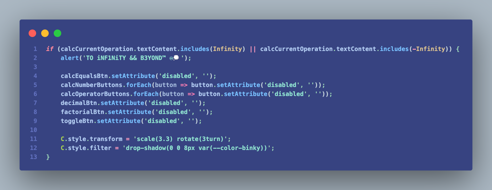

# calculator

A simple calculator written in vanilla HTML, CSS & JavaScript, built for <a href="https://www.theodinproject.com/lessons/foundations-calculator" target="_blank">The Odin Project</a>.

### Notes
I wanted to keep the UX/UI clean and straightforward with a minimal, yet modern aesthetic. My favorite part of authoring this project was creating the animation that is triggered if the calculation results in Infinity. 
### - ツkc💭

## Tools
* VS Code
* Git & Github
* HTML5
* CSS3 
* JavaScript ES6
* Terminal

## Summary
* Used **CSS Grid** to layout the buttons of the calculator accordingly. 
* Used HTML5 **semantic elements** for better readability, structure & accessibility.
* Used **Git** & **GitHub** for source control/project management. 
* **Cross tested** design and functionality on desktop & mobile browsers.

## cloudySnippets💭
